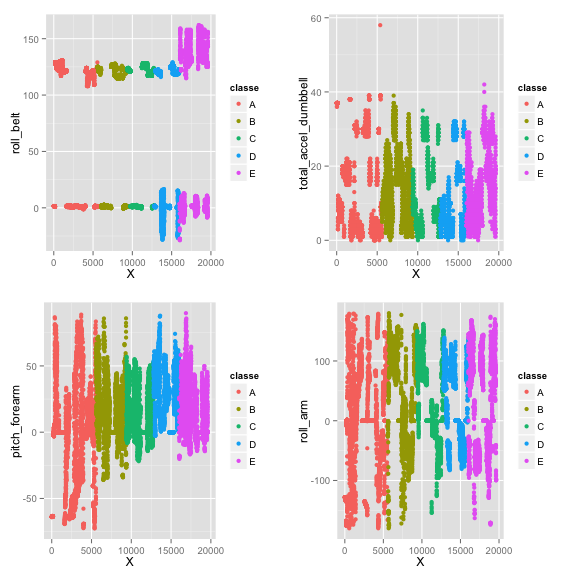

Predicting Quality of Weight Lifting Exercises
========================================================
author: Stephen Dimig
date: Sun Jul 26 13:32:22 2015

Introduction
========================================================
Using devices such as Jawbone Up, Nike FuelBand, and Fitbit it is now possible to collect a large amount of data about personal activity relatively inexpensively. One thing that people regularly do is quantify how much of a particular activity they do, but they rarely quantify how well they do it. 


Introduction (continued)
========================================================
The goal of this project is to predict the manner in which they did a weight lifting exercise (the "classe" variable) from a subset of features whose values are taken from readings on accelerometers on the belt, forearm, arm, and dumbell of 6 participants who ere asked to perform barbell lifts correctly and incorrectly in 5 different ways. This report will:

* Examine several models and pick the best one
* Describe how cross validation was used
* Describe the sample error
* Use the model to predict 20 different test cases


Reading the Data
========================================================
The data was downloaded from a link on the Coursera website and read in as a csv file.

* "#DIV/0!" strings were considered NA values.


```r
library(ggplot2)
library(caret)
require(gridExtra)

df <- read.csv("pml-training.csv", stringsAsFactors=FALSE, na.strings=c("NA", "#DIV/0!"))
inTrain <- createDataPartition(df$classe, p=0.7, list=FALSE)
training <- df[inTrain, ]
testing <- df[-inTrain, ]
```

Exploratory Data Analysis
========================================================
This data is tough to get a feel for due to the large number of features involved. What I tried to do was plot a subset of the features against the X value which is a monotomically increasing integer that is unique for each case, and color the results by the classe variable. The features on the left showed some correlation while the ones on the right appear uncorrelated with classe.

Exploratory Data Analysis (continued)
========================================================
 

Cleaning the Data
========================================================
Several features were removed from the set of predictors after an examination of the data.

* All features with near zero variance were removed. These columns have little variance so they cannot contribute to a prediction.
* The timestamp related variables were removed (raw_timestamp_part_1, raw_timestamp_part_2, and cvtd_timestamp).
* The X column was removed.
* The num_window column was removed.
* All columns with over 13000 NA values in the training set were removed. These might have good information but they were too sparse for a predictor.

Cleaning the Data (code)
========================================================

```r
nzf <- nearZeroVar(training)
training <- training[, -nzf]
training <- training[names(training) != "raw_timestamp_part_1" ]
training <- training[names(training) != "raw_timestamp_part_2" ]
training <- training[names(training) != "user_name" ]
training <- training[names(training) != "cvtd_timestamp" ]
training <- training[names(training) != "X" ]
training <- training[names(training) != "num_window" ]
training <- training[,colSums(is.na(training))<13000]
training$classe <- as.factor(training$classe)
```

Prediction Models 
========================================================
The following models were examined to determine the most accurate.

* Linear
* Boosting
* Random Forest

Cross Validation
========================================================
* The pml-training data was split into a a training and test set.
* The training set was created using roughly 70% of the pml-training data
* The testing set was created using roughly 30% of the pml-training data
* K-Fold cross validation with 10 folds and 4 repeats was used for all of the models.


Linear Model
========================================================
The first type of model attempted was a linear model. A linear model attempts to fit a straight line of the form:

* y = B0 + (B1 * X1) + (B2 * X2) + ... + (Bn * Xn) + e

In this case it is a multi-variate linear regression where the X values are the features and the Y value is the predicted value for the classe variable.

Linear Model (code)
========================================================

```r
set.seed(3311995)
ctrl <- trainControl(method="cv", number = 10, repeats = 4)
modelFit <- train(as.numeric(training$classe) ~., data=training[, -55], method="lm", trControl = ctrl)
pred <- sapply(predict(modelFit, newdata=testing), round)
```

Linear Model (confusion matrix table)
========================================================

```
          Reference
Prediction  -1   0   1   2   3   4   5   6   7
        -1   0   0   0   0   0   0   0   0   0
        0    0   0   0   0   0   0   0   0   0
        1    3  31 639 715 274  12   0   0   0
        2    0   3  50 429 555 101   1   0   0
        3    0   0   5 216 669 134   2   0   0
        4    0   0   0 117 461 364  22   0   0
        5    1   1   2  44 335 430 204  59   6
        6    0   0   0   0   0   0   0   0   0
        7    0   0   0   0   0   0   0   0   0
```

Boosting
========================================================
Gradient boosting is a machine learning technique for regression and classification problems, which produces a prediction model in the form of an ensemble of (possibly) weak prediction models, typically decision trees. It builds the model in stage-wise fashion, by weighting the results and adding them up to form a stronger predictor from the compostion.


Boosting (code)
========================================================

```r
set.seed(3311995)
ctrl <- trainControl(method="cv", number = 10, repeats = 4)
modelFit <- train(training$classe ~., data=training[, -55], method="gbm", trControl = ctrl)
pred <- predict(modelFit, newdata=testing)
```


Boosting (confusion matrix table)
========================================================

```
          Reference
Prediction    A    B    C    D    E
         A 1658    9    3    3    1
         B   38 1076   25    0    0
         C    0   24  984   15    3
         D    1    8   29  925    1
         E    0   12    3   13 1054
```


Random Forests
========================================================
Random forests are an ensemble learning method for classification and regression tasks, that operate by constructing a multitude of decision trees at training time through bootstrap variables, and aggreagating the output based on voting or averaging. Random forests correct for decision trees' habit of overfitting to their training set.

Random Forests (code)
========================================================

```r
set.seed(3311995)
ctrl <- trainControl(method="cv", number = 10, repeats = 4)
modelFit <- train(training$classe ~., data=training[, -55], method="rf", trControl = ctrl, ntree=50)
pred <- predict(modelFit, newdata=testing)
```

Random Forests (confusion matrix table)
========================================================

```
          Reference
Prediction    A    B    C    D    E
         A 1673    1    0    0    0
         B    4 1132    3    0    0
         C    0    2 1020    4    0
         D    0    1    2  961    0
         E    0    1    1    0 1080
```

Model Selection
========================================================
Model selection was done by determining which model provided the best accuracy on the testing set.

|  __Model__    | __Accuracy__  | __Upper__  | __Lower__  |
| --------------| ------------- | ---------- | ---------- |
| Linear        | 0.3916737 | 0.404281 | 0.3791739 |
| Boosting      | 0.9680544 | 0.972399 | 0.9632381 |
| Random Forest | 0.9967715 | 0.9980551 | 0.9949628 |


Conclusions
========================================================
The Random Forest Model was found to have the highest accuracy on the training data and was the model used to predict the values on the test set. The Boosting algorithm was also quite good but took a very long time to run. The Linear Model did not provide good accuracy for this case.

